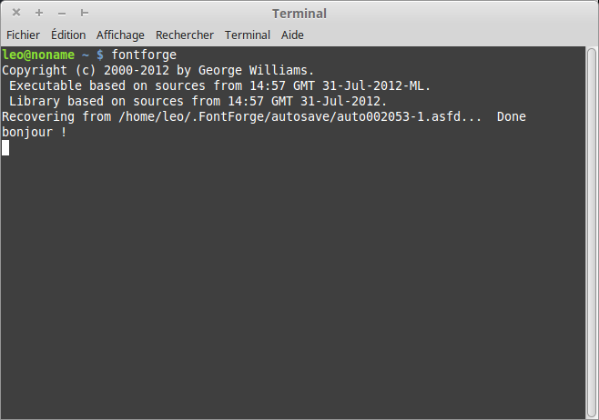
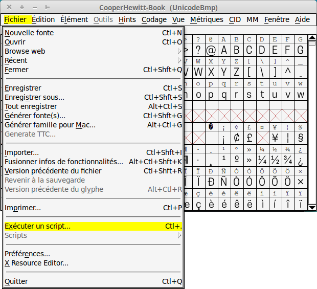
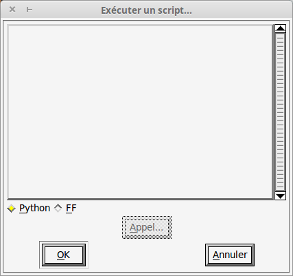
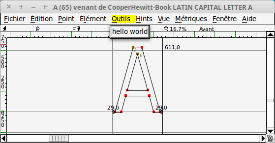

# Programmer en Python dans FontForge

## Introduction

## Démarrage rapide

L’interface utilisateur de FontForge comporte une boite de dialogue « Exécuter un script » permettant l’exécution de code. FontForge donne accès à un interpréteur de son propre langage natif (un dérivé de C et de langage Shell), ainsi qu’un interpréteur python. C’est à ce dernier que nous allons nous intéresser ici.

### Lancer FontForge

FontForge ne dispose pas de console qui nous permettrait de visualiser d’éventuels messages d’erreurs ou d’afficher des données.

Il est nécessaire pour cela de lancer Fontforge via le terminal comme suit :

```bash
fontforge
```

Ce qui nous permettra par la suite d’y afficher des messages comme ci-dessous avec le message *« bonjour ! »*.



### Accéder à l'interpréteur

Pour accéder à l’interpréteur, il faut se rendre dans *Fichier* → *Exécuter un script*



La fenêtre suivante s'ouvre alors.



### Importer le module python fontforge

L’interpréteur permet dès alors de travailler en Python. Toutefois, pour pouvoir dialoguer avec FontForge et accéder à ses différentes fonctionnalités, il est nécessaire d’importer le module python *fontforge*.

Pour cela, on utilise l’instruction suivante :

```python
import fontforge
```

On peut noter qu’il est aussi possible d’importer d’autres modules non relatifs à FontForge, par exemple :

```python
import json
```

### Votre premier script Python pour FontForge

Le programme qui suit va nous permettre d’ajouter un bouton « hello world » dans le menu outils de la fenêtre glyphe, qui. Celui-ci permettra d’imprimer la séquence de caractère « hello world » dans le terminal.

```python
import fontforge

def hello_world(data,glyph):
  print "bonjour !"

fontforge.registerMenuItem(hello_world,None,None,("Glyph"),None,"hello world")
```

L'entrée de menu « hello world » apparaît alors dans le menu « outils » de la fenêtre glyphe.



Le message « bonjour ! » apparaît alors dans le terminal.


## Description du module fontforge

### Types

Le module fontforge définit différents types :

|Type|Propriétés|Méthodes|Usage|
|---|---|
|Point|4|3|Correspond à un point (de contrôle ou pas)|
|Contour|4|24|Un *contour* est une collection de points, formant une courbe basée sur des courbes cubiques ou quadratiques. Les courbes peuvent aussi être exprimés en points Spiro.|
|Layer|1|23|Un *Layer* est une collection de *contours* de même ordre (que du cubique ou que du quadratique).|
|GlyphPen|0|7|Implémentation du [Pen Protocol](http://www.robofab.org/objects/pen.html) qui permet de dessiner dans un glyphe.|
|glyph|50|38|Réfère à un objet glyphe de fontforge. Les glyphes sont toujours liés à une police et ne devraient pas être créés directement.|
|Selection|1|5|Représente une sélection au sein d'une police. Se fait par nom de glyphe ou index. On peut ajouter, enlever des éléments, ou tester leur présence au sein de la sélection.|
|Private|0|1|Représente le dictionnaire PostScript privé de la police.|
|Math|0|2|Représentation d'une éventuelle *math table* d'une police.|
|Font|114|90|Réfère a un objet Font de FontForge. Contient généralement, entre autres, un nom et une liste de glyphes.|

Les chiffres relatifs aux propriétés et méthodes ont été comptés rapidement et n'ont pas été recomptés. Ils sont davantage ici pour donner une idée de la complexité et richesse des différents types.

## Quelques exemples de code pour démarrer

### Exemples simples

#### Sélectionner un glyphe par son nom

```python
fontforge.activeFont().selection.select("A")
```

#### Sélectionner un glyphe par son index

```python
fontforge.activeFont().selection.select(65)
```

#### Ajouter le glyphe B à la sélection

```python
fontforge.activeFont().selection.select(("more",None),"B")
```

#### Enlever le glyphe A de la sélection

```python
fontforge.activeFont().selection.select(("less",None),"A")
```

#### glyphe actif

Ce code renverra None sauf s'il est appelé via une fenêtre Glyphe. Il renverra alors le glyphe de ladite fenêtre.

```python
glyphe_actif = fontforge.activeGlyph()
```

#### index du layer (ensemble de points) actif

```python
fontforge.activeLayer()
```

### Exemples plus complexes

Les exemples plus complexes sont contenus dans le dossier exemples.

* **lister les glyphes sélectionnés :** *lister-glyphes-selectionnes.py*
* **Convertir un glyphe en JSON :** *glyphe-vers-JSON.py*
* **Dessiner un glypheà partir de données JSON :** *dessiner-JSON.py*
* **lister les contours d'un glyphe :** *lister-contours-glyphe.py*
* **lister les points d'un glyphe :** voir la fonction **lister_points** dans *lister-points-de-controle-point.py*
* **lister les points sélectionnés d'un glyphe :** *lister-points-selectionnes-glyphe.py*
* **lister les points de contrôle d'un glyphe :** *lister-points-de-controle-glyphe.py*
* **lister les points de contrôle associés à un point :** *lister-points-de-controle-point.py*
